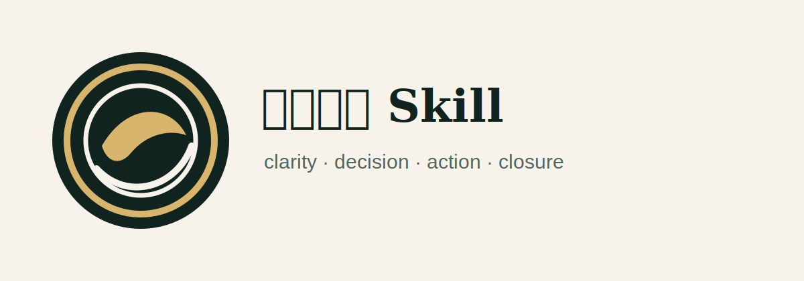

<p align="center">
  
</p>

# 念头通达 Skill

把“念头通达”从弹幕热梗和修心意象，转化为 AI Agent 可以执行的工程心法：调试能清事实，评审能稳心神，取舍能守本心，卡关能做探针，交付后能收念闭环。

本项目受道家修心语义、修仙叙事中的心性门槛，以及《凡人修仙传》相关网络讨论启发，但不隶属于任何作品或权利方。这里提炼的是方法论：让 agent 帮用户把卡住的念头拆成事实、价值、选择、行动和闭环。

## 为什么需要

很多 AI 会安慰人，也会写很漂亮的古风文案，但它们经常做不到这些事：

- 分不清事实和脑补。
- 把“爽一下”误当成“真的通达”。
- 被 review、报错、需求变化、设计争议带偏心神。
- 把一个方案、一段代码、一个设计稿执著成自我价值。
- 给完建议后，没有下一步、验证信号和停止内耗规则。

`niantou-tongda-skill` 的目标是让 agent 不止会说“放下”，而是能帮助用户和自己在项目、代码、设计、办公和复杂关系里看清、取舍、行动、验证、收念。

## 方法结构

```text
niantou-tongda        总入口：道心路由与通达校验
xuanlan-mirror        玄览明镜：分清事实、信号、解释、情绪、未知
heart-knot-diagnosis  心结诊断：识别悔、怨、怕、羞、亏、欲、义
control-boundary      可控边界：划分控制圈、影响圈、观察圈
benxin-decision       本心决断：按价值、代价、边界和验证做选择
wuzhu-action          无住行动：在不确定和不完美中交付最小反馈
pojing-breakthrough   破境攻关：为顽固瓶颈设计最小探针
hanli-long-game       韩立长线：保留后路、证据、复利和选择权
closure-review        收念闭环：行动后复盘并停止重复内耗
tongda-workflows      工作流：组合多个 skill 处理复杂困境
```

## 核心原则

念头通达 = 事实澄明 + 心结可见 + 边界清楚 + 决断干净 + 行动不执 + 瓶颈可破 + 长线不败 + 复盘收束。

它不是压抑情绪，也不是鼓励冲动；不是有仇必报，也不是委屈求全。通达的标志是：做完选择后，用户知道自己为什么这样做，愿意承担代价，并能把注意力收回到行动。

## 理论来源

本项目综合了：

- 道家：涤除玄览、心斋、坐忘、知止。
- 儒家：反求诸己、义利之辨、日参省。
- 禅宗：无住生心。
- 斯多葛：可控与不可控的区分。
- CBT / ACT：自动想法、认知解离、价值行动。
- 工程方法：OODA、敏捷、最小可验证探针、blameless postmortem。

详细映射见 [theory-map.md](skills/niantou-tongda/theory-map.md) 和各 skill 的 `original-texts.md`。

## 安装到 Codex

源码方式：

```bash
git clone https://github.com/zxS33/niantou-tongda-skill.git
cd niantou-tongda-skill
node ./bin/niantou-tongda-skill.mjs install --target codex --scope user
```

然后开启新会话，检查 skill 列表中是否出现 `niantou-tongda`。

更多说明见 [.codex/INSTALL.md](.codex/INSTALL.md)。

其他平台：

```bash
node ./bin/niantou-tongda-skill.mjs install --target opencode --scope user
node ./bin/niantou-tongda-skill.mjs install --target claude-code --scope user
node ./bin/niantou-tongda-skill.mjs install --target all --scope user
```

## 手动命令入口

支持 Markdown slash commands 的宿主可以使用 `commands/`：

```text
/niantou-tongda
/xuanlan-mirror
/heart-knot-diagnosis
/control-boundary
/benxin-decision
/wuzhu-action
/pojing-breakthrough
/hanli-long-game
/closure-review
/tongda-workflows
```

不支持命令目录的宿主，直接读取同名 command 文件或 `skills/*/SKILL.md`。

## 会话入口

`hooks/session-start` 会注入 `skills/niantou-tongda/SKILL.md` 作为轻量总入口。它只负责建立“心无滞碍，行动有据”的路由和校验框架，不会强行加载全部方法。

## 验证

```bash
npm test
```

验证内容包括：

- 必要文件是否存在。
- skills 和 commands frontmatter 是否有效。
- slash command 是否覆盖全部 skill。
- README 和文档中的本地链接是否有效。
- 是否残留初始化模板占位文本。

## 项目结构

```text
niantou-tongda-skill/
├── agents/
│   └── daoxin-reviewer.md
├── commands/
├── hooks/
├── skills/
│   ├── niantou-tongda/
│   ├── xuanlan-mirror/
│   ├── heart-knot-diagnosis/
│   ├── control-boundary/
│   ├── benxin-decision/
│   ├── wuzhu-action/
│   ├── pojing-breakthrough/
│   ├── hanli-long-game/
│   ├── closure-review/
│   └── tongda-workflows/
├── docs/
├── bin/validate.mjs
├── bin/niantou-tongda-skill.mjs
├── README.md
└── README.en.md
```

## 示例

查看 [docs/example.md](docs/example.md)。

## 边界

本项目不是心理治疗、法律意见或危机干预工具。如果问题涉及自伤、伤人、违法、跟踪、威胁、骚扰、医疗或法律高风险事项，必须优先处理安全与合规。

## License

MIT
